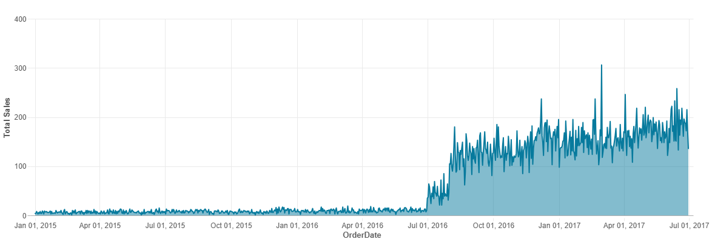
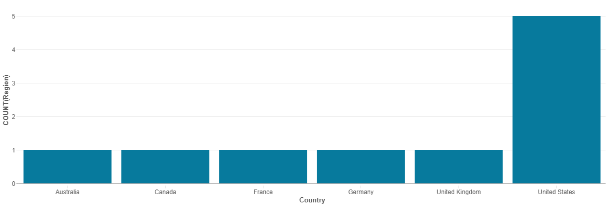

# Adventure Works Data Engineering Project  

## Overview  
This project is a full Data Engineering pipeline with Azure solutions on the Adventure Works dataset. The pipeline is made up of data ingestion, data transformation, as well as serving, with Azure Data Factory, Azure Databricks, Azure Data Lake Gen2, and Azure Synapse Analytics. The emphasis is on efficiently processing and presenting the dataset in a bid to attain analytical insights.  

## Dataset Characteristics  
The data comprises 10 CSV files:  
1. `calendar.csv` - date-based data.  
2. `customers.csv` - contains customer information.  
3. `product_categories.csv` - Product category data.  
4. `product_sub_categories.csv` - Product subcategories  
5. `products.csv` - Product information.  
6. `returns.csv` - Product return transactions are recorded.  
7. `sales2015.csv` - Sales data from 2015.  
8. `sales2016.csv` - sales in 2016.  
9. `sales2017.csv` - Sales data from 2017.  
10. `territories.csv` - Sales territory information.  

## Architecture and Flow  
### 1. Ingesting Data  
- **Tool utilized:** Azure Data Factory (ADF)  
- **Approach**  
  - Added dynamic data retrieval from GitHub.  
  - Used looping and lookup activities to process multiple datasets.  
  - Configured pipelines that pull raw data from Azure Data Lake Gen2.  

### 2. Data Transformation & Analysis  
- **Tool utilized:** Azure Databricks & Azure Data Lake Gen2  
- **Approach**  
  - Loaded raw data from Azure Data Lake Gen2.  
  - Carried out data formatting, cleaning, and transformation with PySpark.  
  - Integrated sales data from a series of years into a single database.  
  - Dealt with missing values and made data consistent.  
  - **Carried out Big Data Analysis:** Developed visualization with PySpark in order to determine trends and patterns.  

#### Visualizations Examples  
1. **Sales Trend**  
     
2. **Product Category Sales Distribution**  
     
3. **Region Segmentation by Country**  
     

### 3. Serving Data and Visualization  
- **Service utilized:** Azure Synapse Analytics  
- **Approach**  
  - Developed a **Synapse Analytics external table** that refers to Azure Data Lake Gen2 transformed data.  
  - Supported querying of the external table for enhanced visualization and analysis.  
  - Enabled data accessibility for reporting as well as business intelligence solutions.  

## Tools & Technologies Used  
- **Azure Data Factory (ADF):** To oversee data ingestion pipelines.  
- **Azure Data Lake Gen2:** To hold raw as well as processed data.  
- **Azure Databricks:** To execute data transformations with PySpark.  
- **Azure Synapse Analytics:** To query and deliver processed data.  
- **GitHub:** Source code repository with raw data files.  
- **PySpark:** For big data visualization as well as processing.  

## Main Features Implemented  
- **Automated Ingestion of Data:** Leveraging ADF lookups and loops in order to dynamically pull data from GitHub.  
- **Scalable data processing:** Utilized Apache Spark on Databricks for big data transformation.  
- **Big Data Analytics & Visualization:** Conducted exploratory data analysis and created visualization insights with PySpark.  
- **Fast Serving of Data:** Direct querying over processed data with no extra cost in terms of additional storage.  
- **Infrastructure in Cloud:** Leveraging Azure resources for scale, stability, and cost-effectiveness.  

## Future Improvements  
- **Incremental Imports of Data:** Use pipelines that load new or updated data in preference over full data.  
- **Improve Data Transformations:** Use more business logic in order to enhance data usability.  
- **Integrations with BI Tools:** Integrate with either Power BI or Tableau for more advanced analytics and visualization.  
- **Performance Tuning:** Enhance query speed in Synapse Analytics with faster data retrieval.  

## Conclusion  
This project clearly defines a cloud-based data pipeline in a live scenario with a sample dataset. Leveraging Azure resources, we ingested, transformed, and served Adventure Works data with ease, making data analysis and reporting a hassle-free experience.
